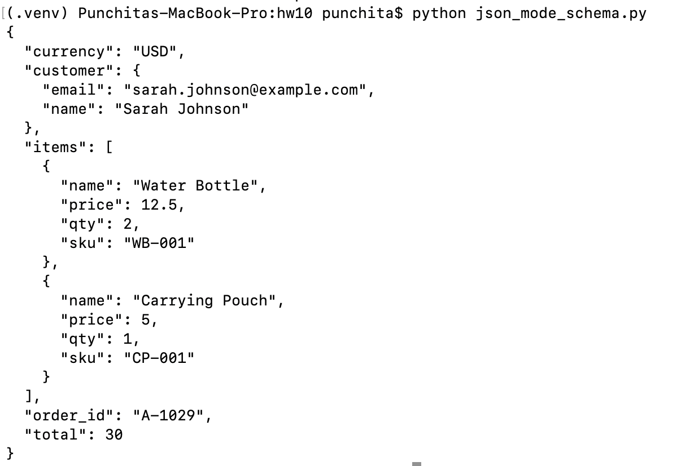
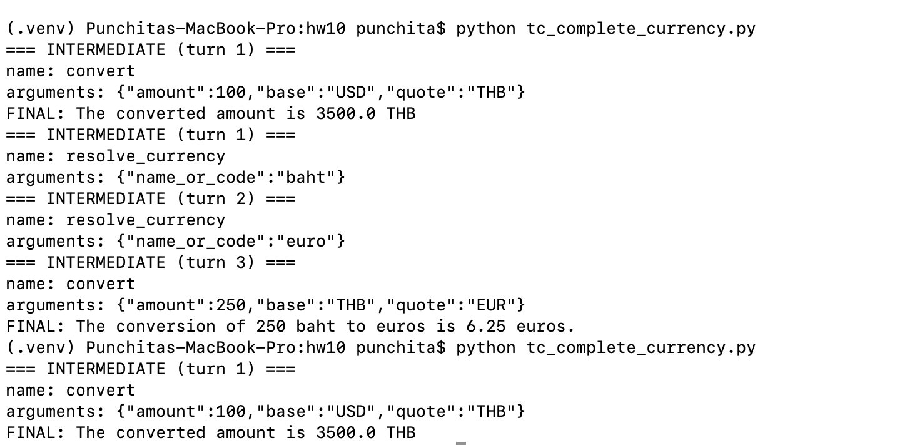
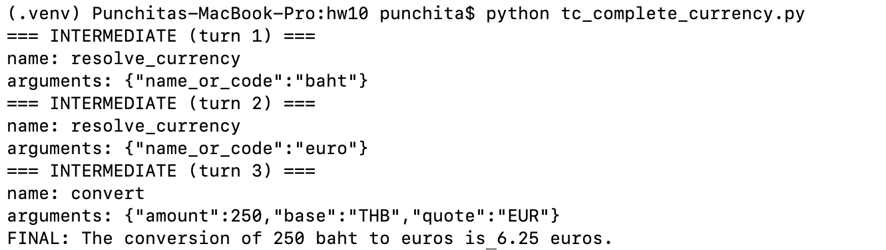
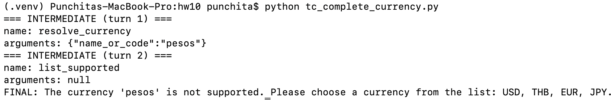
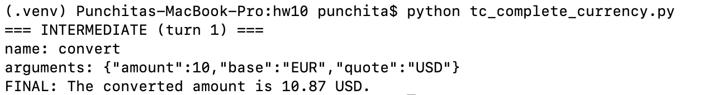
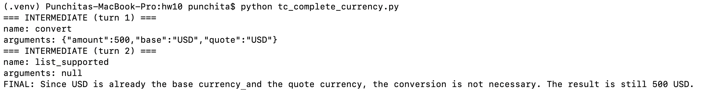

# HW10 — JSON Mode & Tool Calling (LiteLLM)

Tho parts:

**- Schema-validated extractor**

**- Currency mini-agent (simulated)**

---

## 1) Schema-Validated Extractor  
>Nested JSON with a strict schema.  

**Input:** order text → **Output:** structured JSON  
messages = [
  {"role": "system", "content": "Return ONLY a JSON object matching the schema."},
  {"role": "user", "content": "Order A-1029 by Sarah Johnson : 2x Water Bottle ($12.50 each), 1x Carrying Pouch ($5). Total $30."}
]

response_format={"type": "json_schema", "json_schema": schema},
)

Result:  

---

## 2) Currency Mini-Agent  
>Tool calling with mock exchange rates.  

We tested 5 cases:

### Case 1 — 100 USD → THB  

Result: 

### Case 2 — 250 baht → EUR  

Result: 

### Case 3 — 50 pesos → USD *(unsupported → list options)*  

Result: 

### Case 4 — 10 EUR → USD  

Result: 

### Case 5 — 500 USD → USD  

Result: 

---

## P.S.
- Using 'temperature=0.2' for stable tool selection  
